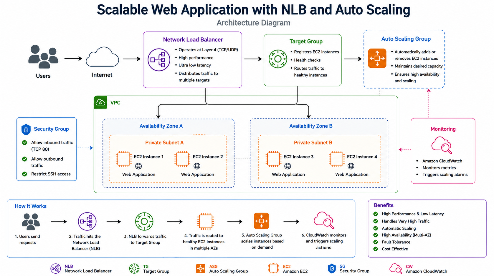
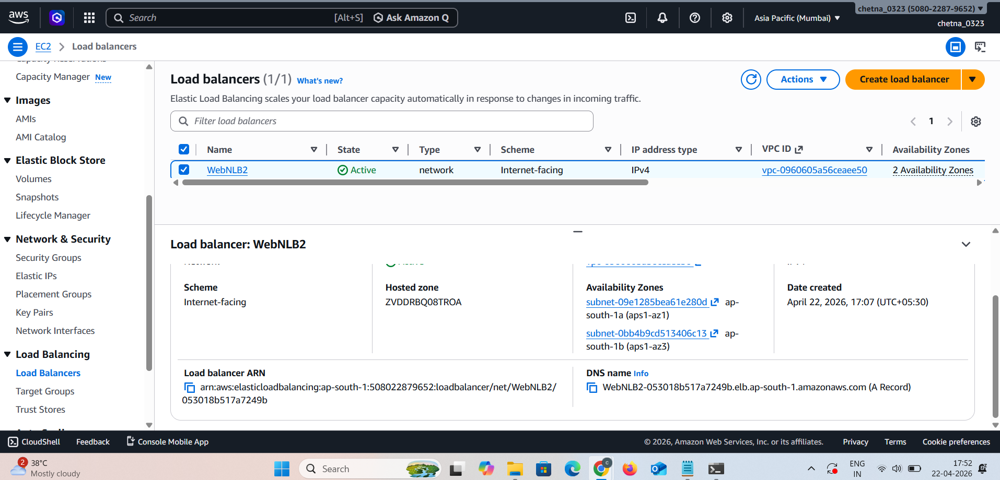
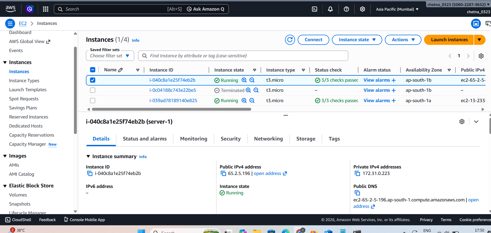
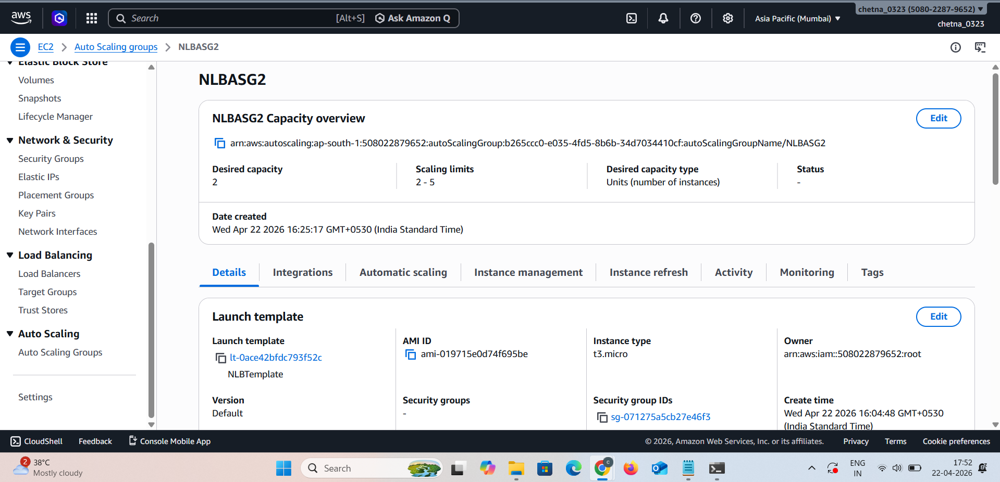
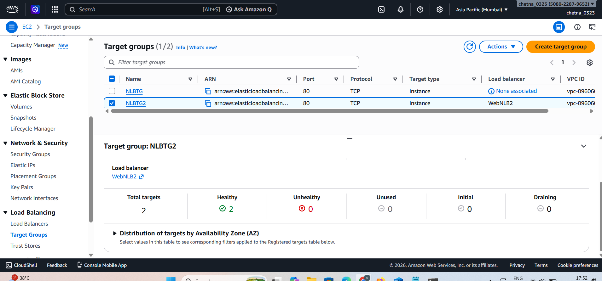

🚀 Scalable Web Application using NLB & Auto Scaling


---

📌 Project Overview

This project demonstrates how to build a **high-performance and low-latency scalable web application** using AWS services.

The application handles heavy traffic efficiently by distributing requests using a **Network Load Balancer (NLB)** and dynamically scaling EC2 instances using an **Auto Scaling Group (ASG)**.

---

🎯 Purpose

* Handle very high traffic efficiently
* Provide low-latency performance
* Ensure high availability
* Automatically scale infrastructure

---

🧰 AWS Services Used

* Amazon EC2
* Network Load Balancer (NLB)
* Auto Scaling Group (ASG)
* Target Group
* Security Groups

---

🏗️ Architecture Diagram



**Flow:**

User → NLB → Target Group → EC2 Instances (Auto Scaling)

---

⚖️ Network Load Balancer



The Network Load Balancer distributes traffic at **Layer 4 (TCP/UDP)**, providing ultra-low latency and handling millions of requests efficiently.

---

🖥️ EC2 Instances



Multiple EC2 instances host the web application and are automatically scaled based on traffic demand.

---

📊 Auto Scaling Group



Auto Scaling ensures:

* Minimum instances are always running
* New instances launch during high traffic
* Instances terminate when traffic decreases

---

🎯 Target Group



The target group:

* Registers EC2 instances
* Performs health checks
* Routes traffic only to healthy instances

---

🌐 Application Output


This output confirms:

* Load Balancer is working
* Traffic is reaching EC2 instances successfully

---

🔥 Key Features

* High performance (Layer 4 load balancing)
* Ultra-low latency
* Automatic scaling
* High availability (Multi-AZ)
* Fault tolerance

---

📁 Project Structure

```
Scalable-Web-App-NLB-ASG/
│── index.html
│── README.md
│── screenshots/
│    ├── nlb.png
│    ├── ec2.png
│    ├── asg.png
│    ├── target-group.png
│    ├── output.png
│    ├── architecture.png
```

---

🧠 How It Works

1. User sends request
2. NLB receives request
3. NLB forwards request to target group
4. Target group selects healthy EC2 instance
5. Auto Scaling adjusts instances based on traffic

---


---

✅ Conclusion

This project demonstrates how AWS services like **NLB and Auto Scaling** can be used to build a **high-performance, scalable, and reliable web application architecture**, ideal for systems requiring **low latency and high throughput**.

---
